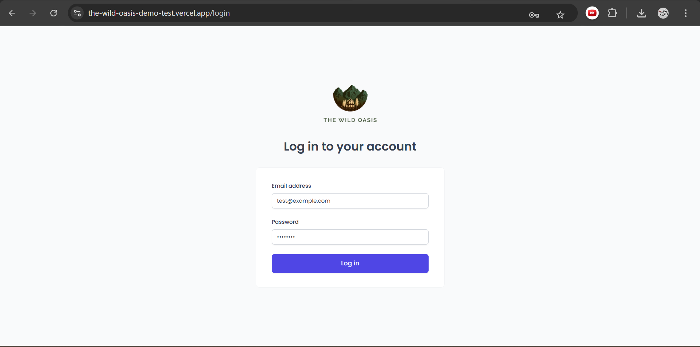
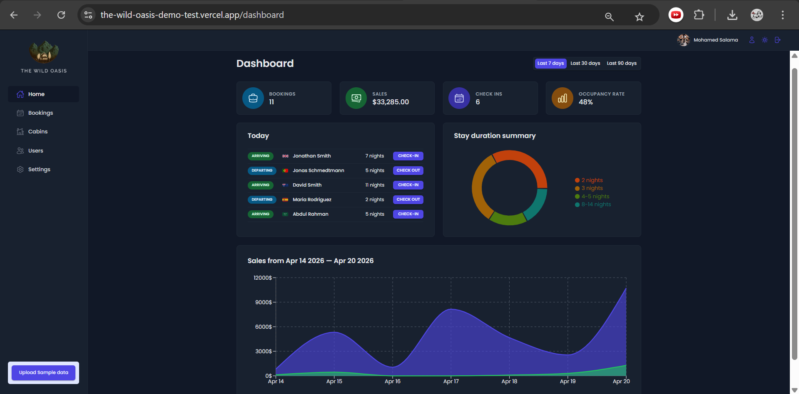
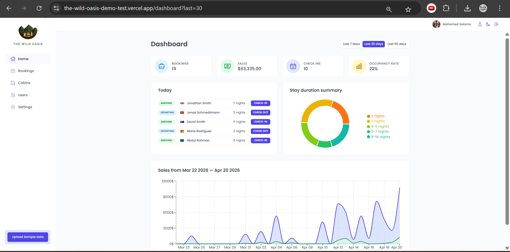
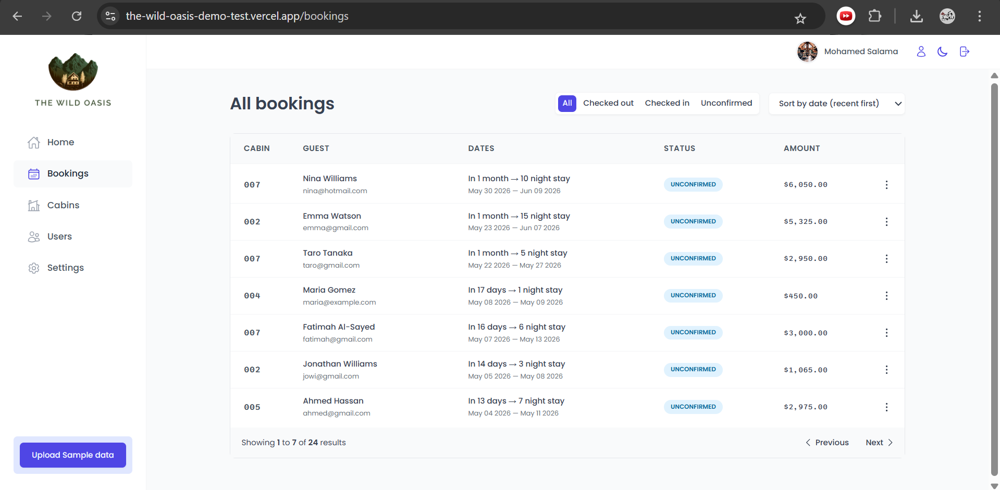
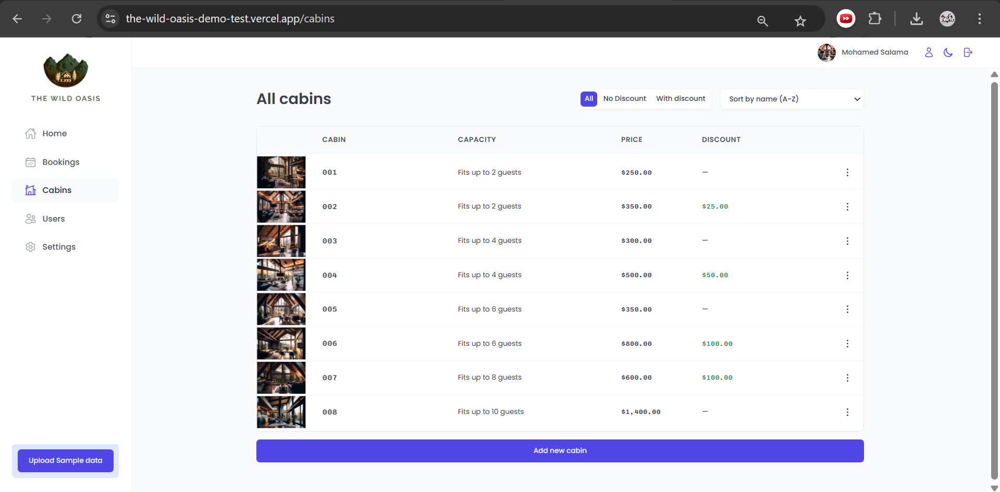
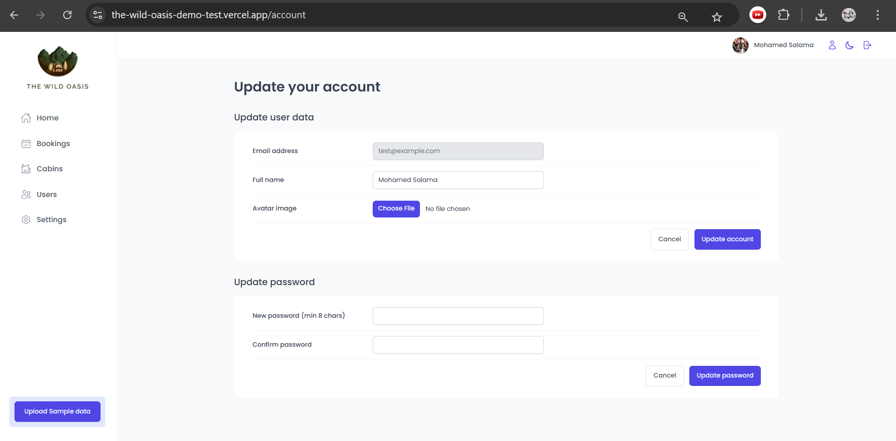

# 🌴 The Wild Oasis

A modern hotel management dashboard built with React, designed to manage cabins, bookings, users, and hotel settings efficiently through a clean and intuitive interface.

> ⚠️ **Desktop version only** — This application is optimized for desktop screens and is not responsive.

---

## 🚀 Live Demo

👉 https://the-wild-oasis-demo-test.vercel.app/

---

## 📸 Screenshots

### 🔐 Login



---

### 📊 Dashboard (Dark Mode)



### 📊 Dashboard (Light Mode)



---

### 📅 Bookings



---

### 🏡 Cabins



---

### 👤 Account Settings



---

## 📁 Project Structure

```
src/
├── context/
├── data/
├── features/
├── hooks/
├── pages/
├── services/
├── styles/
├── ui/
├── utils/
├── App.jsx
├── main.jsx
```

---

## ✨ Features

* 🔐 Authentication system (Login / Logout)
* 📊 Dashboard with analytics and charts
* 📅 Manage bookings (filter, status, sorting)
* 🏡 Cabin management (add, edit, pricing, discounts)
* 👥 User management
* ⚙️ Hotel settings configuration
* 🌙 Dark & Light mode support
* 📈 Interactive data visualization

---

## 🛠️ Tech Stack

* ⚛️ React
* ⚡ Vite
* 🎨 Styled Components
* 📊 Recharts
* 🔥 Supabase (Backend & Auth)
* 🧠 React Query
* 📦 React Router

---

## ⚙️ Getting Started

### 1. Clone the repository

```bash
git clone https://github.com/your-username/the-wild-oasis.git
cd the-wild-oasis
```

### 2. Install dependencies

```bash
npm install
```

### 3. Run the project

```bash
npm run dev
```

---

## 🔑 Demo Credentials

```bash
Email: test@example.com
Password: 12345678
```

---

## 📌 Notes

* Desktop version only (not responsive)
* Built as part of a React learning journey
* Focused on real-world dashboard experience

---

## 👨‍💻 Author

**Mohamed Salama**

---

## ⭐ Support

If you like this project, consider giving it a star ⭐ on GitHub!
